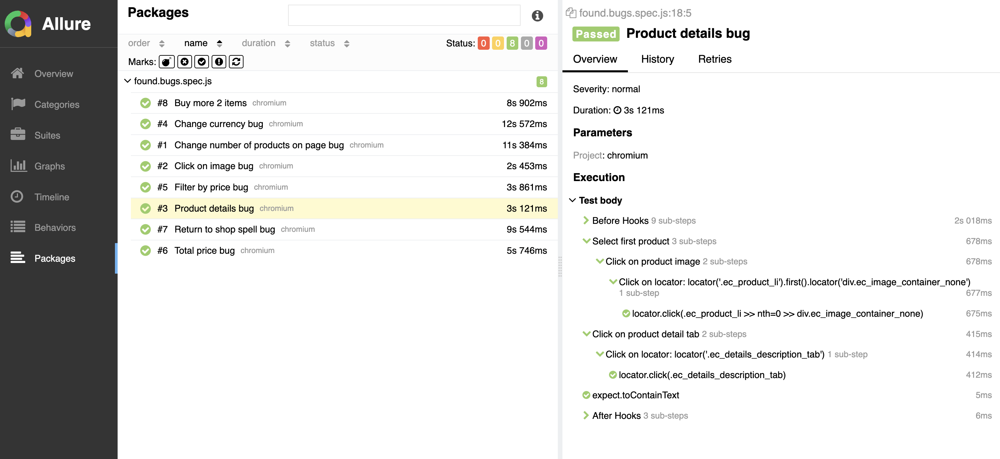

# Academy Bugs

This project contains a suite https://academybugs.com/. The tests are written in JavaScript using the Playwright framework.

## Project Structure

- `tests/tests.spec.js`: Contains the API tests for various endpoints.
- `README.md`: Project documentation.

## Installation

To get started with the project, follow the steps below:

1. Clone the repository: `git clone <repository-url>`
2. Navigate to the project directory: `cd <project-directory>`
3. Install the dependencies: `npm i`

## Running the Tests

To run the tests, use the following command:

```sh
npm run test
```

## Test Report

After running the tests, a test report will be generated in the `.allure-result` directory. To view the report, use the following command:

```sh
npm run allure
```

**Allure Test Report Results**


   

